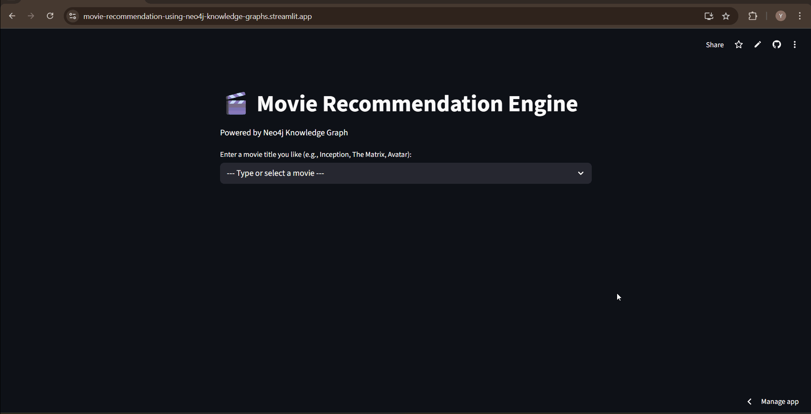

# 🎬 Movie Recommendation Engine

This project is a movie recommendation engine that uses a Neo4j Knowledge Graph, graph embeddings (GDS), and a Streamlit web app. It provides both semantic and machine-learning-based recommendations.



### **[🔗 Live Demo](https://movie-recommendation-using-neo4j-knowledge-graphs.streamlit.app/)**

*Note: The deployed version connects to a free AuraDB instance, which does not include the GDS plugin. Therefore, it only showcases the "Basic Recommendations" (semantic search).*

---

## 💡 Project Insights

* **Graph Databases Excel at Connected Data:** Neo4j made querying relationships (like actors in multiple movies) significantly easier and more intuitive than using SQL JOINs.
* **Semantic vs. ML Recommendations:** The basic semantic recommendations (shared actors/genres) are interpretable but often predictable. The graph embedding (ML) recommendations uncover less obvious, "deeper" similarities based on the overall graph structure, providing more diverse suggestions.
* **GDS Power:** The Neo4j Graph Data Science library provides powerful, optimized algorithms (like Node2Vec and KNN) that can be run directly on the graph data, simplifying the ML workflow.
* **Cloud Limitations:** Free cloud tiers (like AuraDB Free) often have limitations (e.g., no GDS plugin), requiring adjustments for deployment versus local development.

---

## ✨ Features

* **Basic Recommendations:** Finds similar movies based on shared actors and genres (semantic search).
* **Advanced Recommendations (Local Version):** Uses `Node2Vec` graph embeddings to find movies with "deep similarity" based on the entire graph structure.
* **Cloud Connected:** The live app is connected to a Neo4j AuraDB (cloud database).
* **Interactive UI:** A simple Streamlit app to enter a movie title and get results.
* **Case-Insensitive:** Search is case-insensitive (e.g., "The Matrix" and "the matrix" both work).
  
---

## 🛠️ Tech Stack

* **Database:** Neo4j (Local Desktop for GDS, AuraDB Free for deployment)
* **Graph Machine Learning:** Neo4j Graph Data Science (GDS) library (using `Node2Vec` and `k-Nearest Neighbors`)
* **Backend & Data Loading:** Python (`neo4j` driver, `pandas`)
* **Frontend:** Streamlit

---

## How It Works

This project has two main parts:

1.  **Basic Semantic Recommendations**

    These queries run on both the local and deployed versions. They work by traversing the graph to find shared connections.
    
    **Query Logic:**
    * Find the movie the user entered.
    * Find all actors (`:Actor`) connected via `[:ACTED_IN]`.
    * Find all genres (`:Genre`) connected via `[:HAS_GENRE]`.
    * Find *other* movies that share the most actors and genres, and rank them.

2.  **Advanced Embedding Recommendations (Local Version)**

    This query only runs in the local Neo4j Desktop version because it requires the GDS plugin.
    
    **ML Pipeline:**
    * **Project Graph:** The full graph of Movies, Actors, and Genres is loaded into GDS.
    * **Train Embeddings:** The `gds.node2vec` algorithm is run to create a 128-dimension vector (an "embedding") for every node, capturing its "essence" in the graph.
    * **Write Embeddings:** The learned vectors are saved back to the `:Movie` nodes in the database.
    * **Recommend:** When a user searches, the app runs `gds.knn.stream` (k-Nearest Neighbors) to find the 10 movies with the most mathematically similar vectors.

---

## 🖥️ How to Run The FULL Project Locally

The deployed version is simplified. To run the full-featured version with advanced ML recommendations, you must run it on your local machine.

**Prerequisites:**
* Python 3.8+
* Neo4j Desktop
* The **Graph Data Science (GDS)** plugin installed in Neo4j Desktop (see Step 2)

**Steps:**

1.  **Clone the Repository:**
    ```bash
    git clone https://github.com/rishii-05/movie-recommendation-using-neo4j-knowledge-graphs.git
    cd movie-recommendation-engine
    ```

2.  **Set Up Neo4j Desktop:**
    * Open Neo4j Desktop.
    * Create a new local database.
    * Go to the "Plugins" tab for that database.
    * Install the **Graph Data Science** plugin.
    * Start the database and set your password.

3.  **Install Python Libraries:**
    ```bash
    pip install -r requirements.txt
    pip install jupyter # To run the data loading notebook
    ```

4.  **Download the Dataset & Load the Data:**
    * **Download:** This project uses the "TMDB 5000 Movie Dataset". Download the `tmdb_5000_movies.csv` and `tmdb_5000_credits.csv` files from [Kaggle](https://www.kaggle.com/datasets/tmdb/tmdb-movie-metadata).
    * **Place Files:** Put both downloaded CSV files directly into your `movie-recommendation-engine` project folder (the same folder as `app.py`).
    * **Load:** Open the `Movie_recommender.ipynb` notebook.
    * In the first cell, update your **Neo4j URI and password** to match your local database.
    * Run all cells in the notebook. This will load the CSV data into your local Neo4j.

5.  **Run the GDS/Embedding Pipeline:**
    * Open your **Neo4j Browser** (from Neo4j Desktop).
    * Run the GDS queries one by one to create and save the embeddings (these are in the `Movie_recommender.ipynb` notebook at the end, or in the `app.py` `check_and_create_gds_graph` function).

6.  **Run the App:**
    * In your `app.py` file, make sure the `URI`, `USER`, and `PASSWORD` are set to your **local** database (e.g., `bolt://localhost:7687`).
    * Run the app:
        ```bash
        streamlit run app.py
        ```
    * The app will now show both basic and advanced recommendations.

---

## 📂 Project Structure

```
movie-recommendation-using-neo4j-knowledge-graphs/
|
├── .devcontainer/           # VS Code Dev Container configuration (optional)
├── Demo.gif                 # Animated GIF demonstrating the app (used in README)
├── Movie_recommender.ipynb  # Jupyter Notebook for data loading and GDS pipeline (local setup)
├── app.py                   # The main Streamlit application script
├── .gitignore               # Specifies files for Git to ignore
├── requirements.txt         # Project dependencies
└── README.md                # You are here!
```

---

## 🚀 Future Improvements

* **More Data:** Integrate richer data sources, such as user ratings (if available), movie synopses (for NLP-based similarity), or production companies.
* **Hybrid Recommendations:** Combine the results from the basic semantic search and the advanced embedding search for potentially better results.
* **User Profiles:** If user data were available, create `(:User)` nodes and `[:RATED]` relationships to build collaborative filtering or personalized recommendations.
* **Refine Embeddings:** Experiment with different GDS embedding algorithms (like FastRP or GraphSAGE) or tune the parameters of Node2Vec.
* **UI Enhancements:** Add features like movie posters, links to IMDb/Rotten Tomatoes, or filtering recommendations by genre.
* **Deployment with GDS:** Deploy the full version (with GDS) using a paid AuraDB tier or a self-hosted Neo4j instance on a cloud server.
